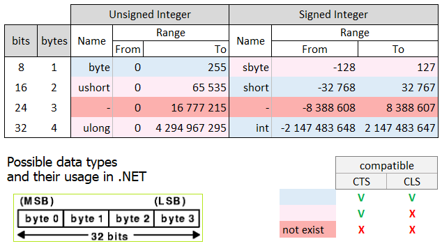
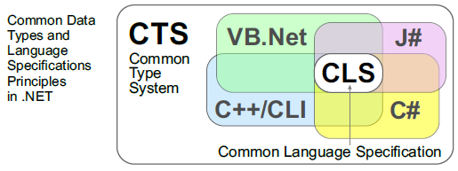
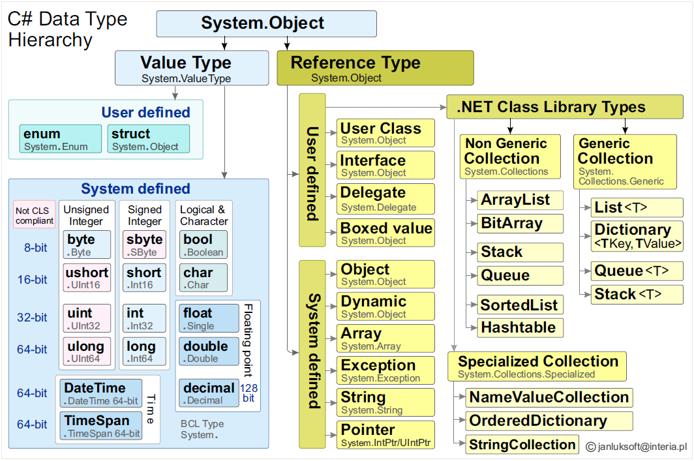

# Data types in .NET

## Possible data types and their use in .NET




Above is a table with all the possibilities of using integers.

Digital devices operate on data and in most of them a single data is a
byte. Disk capacity is given in Terabytes, memory in Gigabytes.

A byte is an eight-element vector. Each of the eight elements of a byte
is called a bit and a bit can take values ​​from the two-element set
{0,1};

Consider the following two bytes: lower, higher: 10011101b, 11000100b.

In C# naming the same two bytes can have at least 5 meanings:

- Two byte values: 157, 196
- Two sbyte values: -99, -60<br>
- One ushort: 50333
- One short: -15203
- One char 쒝 (Unicode) (China)

So it is important how to interpret the data.

## Common Data Types and Language Specifications Principles





In order to organize data types and
objects in the .NET framework, two levels of principles were introduced:

**CTS** (Common Type System) -- greater freedom;

**CLS** (Common Language Specification) greater restrictions;

**CTS** is a standard that generally defines data types and describes
how individual data types are represented in memory. It also provides
many advanced mechanisms. In the most important CTS:

-   Defines integration structures common to many .NET languages;

-   Provides data type definitions along with type safety mechanisms;

-   Provides mechanisms for creating efficient (machine) code;

-   Defines and provides an object model that works and is compatible in
    many languages, which ensures that objects written in different
    languages ​​will be compatible in other languages;

-   Provides primitive data types such as Boolean, Char, Byte, Int32,
    etc.

CLS is a subset of CTS but is more rigorous. It defines a set of rules
that every language in the .NET Framework should follow in order to
fully utilize the concepts of exception handling, inheritance,
polymorphism, and other features. Such languages ​​are called
CLS-compliant. CLS enables cross-language integration. This is
especially important for programmers who write libraries. These
libraries must use only elements allowed in the CLS. Then such libraries
can be used by any language with the CLS. And there are over 40 of these
languages.

## Example of type definitions

For example, type definitions specify how to read data of individual
types:

-   **short** type: from \[Address\] get 16 bits, 15 bits is the value,
    treat the highest bit as a sign;

-   **ushort** type: from \[Address\] get 16 bits, 16 bits is the value,
    all non-negative numbers;

-   **int** type: from \[Address\] get 32 ​​bits, 31 bits is the value,
    treat the highest bit as a sign;

-   **uint** type: from \[Address\] get 32 ​​bits, 32 bits is the value,
    all non-negative numbers;

## Example of efficient code

In the example of creating efficient code, you can see that, for
example, the x86 processor itself has a group of machine instructions
supporting data types such as uint and int.

e.g. Jump then signed overflow occurs:

```assembly
    mov eax, 07FFFFFFFh     ; EAX = 2,147,483,647 (int.MaxValue)
    add eax, 1              ; Signed overflow: EAX wraps to -2,147,483,648
    jo OverflowSigned       ; Jump if signed overflow occurs
```

e.g. Jump then unsigned overflow occurs:

```assembly
    mov eax, 0FFFFFFFFh     ; EAX = uint.MaxValue (4294967295)<br>
    add eax, 1              ; EAX = 0, CF = 1 (unsigned overflow detected)<br>
    jc OverflowDetected     ; Jump if carry flag is set (indicates unsigned overflow)
```
For the speed of operation of the type, e.g. sbyte (signed byte), you
can use the \[jo\] instruction, and this is done, for example, by C#.
But the more restrictive CLS rules do not allow such a type and the
universality of types will result in the generation of several
instructions (instead) and slower operation.

Therefore, it is worth considering different ways of using the
mechanisms provided by .NET.

## C# Data Type Hierarchy (System.Object)

Below in the diagram is the type hierarchy defined in C#.



This structure is described further. It consists of two important
groups:

-   \[**Value Type**\] - data of known length, which can be placed on
    the stack;

-   \[**Reference Type**\] -- variable-length data of which only the
    address can be placed on the stack, and the data on the heap.

**Value Type (System.ValueType)**

Value types store data directly in memory and are allocated on the stack
or inline within objects.

-   **User-defined Value Types:**

    -   **D1: Enum (System.Enum)** -- A set of named constant values
        (e.g., enum Color { Red, Green, Blue }).

    -   **D2: Struct (System.ValueType)** -- A lightweight object with
        value semantics (e.g., struct Point { int x, y; }).

-   **System-defined Value Types:**

    -   **D3: Unsigned Integer** -- Can only store non-negative values.

        -   byte (System.Byte): 8-bit unsigned integer (0 to 255).

        -   ushort (System.UInt16): 16-bit unsigned integer (*not CLS
            compliant*).

        -   uint (System.UInt32): 32-bit unsigned integer (*not CLS
            compliant*).

        -   ulong (System.UInt64): 64-bit unsigned integer (*not CLS
            compliant*).

    -   **D4: Signed Integer** -- Can store both positive and negative
        values.

        -   sbyte (System.SByte): 8-bit signed integer (*not CLS
            compliant*).

        -   short (System.Int16): 16-bit signed integer.

        -   int (System.Int32): 32-bit signed integer (default integer
            type).

        -   long (System.Int64): 64-bit signed integer.

    -   **D5: Logical and Character Types**

        -   bool (System.Boolean): Represents true or false (internally
            stored as 1-bit).

        -   char (System.Char): Represents a 16-bit Unicode character.

    -   **D6: Floating Point Types**

        -   float (System.Single): 32-bit floating-point number.

        -   double (System.Double): 64-bit floating-point number
            (default for decimal numbers).

        -   decimal (System.Decimal): 128-bit precise decimal type (for
            financial calculations).

    -   **D7: Time-related Types**

        -   DateTime (System.DateTime): Represents date and time values
            (64-bit).

        -   TimeSpan (System.TimeSpan): Represents time intervals
            (64-bit).

**Reference Type (System.Object)**

Reference types store memory addresses (pointers) rather than actual
data. They reside in the heap.

-   **User-defined Reference Types:**

    -   **D8: Class (System.Object)** -- The fundamental type for
        defining objects and behaviors.

    -   **D9: Interface (System.Interface)** -- A contract that defines
        a set of methods without implementation.

    -   **D10: Delegate (System.Delegate)** -- A reference to a method,
        enabling event-driven programming.

    -   **D11: Boxed Value (System.Object)** -- A value type stored as
        an object (boxing and unboxing).

    -   **D12: .NET Class Library Types** -- Built-in collections and
        data structures.

        -   **D12.1: Non-Generic Collections (System.Collections)**

            -   ArrayList -- A dynamically resizable array.

            -   BitArray -- Stores a collection of bits as Boolean
                values.

            -   Stack -- Last-In-First-Out (LIFO) data structure.

            -   Queue -- First-In-First-Out (FIFO) data structure.

            -   SortedList -- Key-value pairs sorted by keys.

            -   Hashtable -- Key-value pairs stored with hashing.

        -   **D12.2: Generic Collections (System.Collections.Generic)**

            -   List\<T\> -- A type-safe dynamic array.

            -   Dictionary\<TKey, TValue\> -- A key-value collection.

            -   Queue\<T\> -- A generic FIFO queue.

            -   Stack\<T\> -- A generic LIFO stack.

            -   HashSet\<T\> -- A collection of unique elements.

        -   **D12.3: Specialized Collections
            (System.Collections.Specialized)**

            -   StringCollection -- A collection of strings.

            -   NameValueCollection -- A collection of key-value string
                pairs.

            -   OrderedDictionary -- A dictionary that maintains
                insertion order.

-   **System-defined Reference Types:**

    -   **D13: Object (System.Object)** -- The base type from which all
        reference types inherit.

    -   **D14: Dynamic (System.Object)** -- A runtime-bound object type
        (resolved dynamically).

    -   **D15: Array (System.Array)** -- The base type for arrays in C#.

    -   **D16: Exception (System.Exception)** -- The base class for
        error handling.

    -   **D17: Pointer (System.IntPtr / System.UIntPtr)** -- Used in
        unsafe operations for memory access.

    -   **D18: String (System.String)** -- An immutable sequence of
        Unicode characters.

## This chapter is part of the main project

This chapter is part of the <a href="https://github.com/janluksoft/NET_MainComparison">NET Main Comparison project</a>:<br> 
"Comparison of software development methods from low-level methods to .NET".

The next chapter is:
<a href="https://github.com/janluksoft/NET_ExecutionModel">.NET CLR execution model</a>
